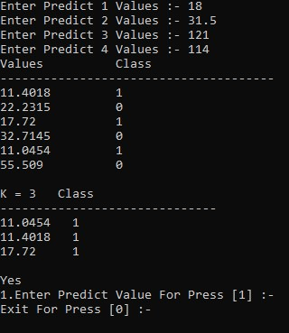

# k-Nearest Neighbors (kNN) Implementation in C++

This project is a simple command-line implementation of the k-Nearest Neighbors (kNN) algorithm in C++. The program classifies new data points based on the classes of their nearest neighbors in a training dataset.

## About the kNN Algorithm

The k-Nearest Neighbors algorithm is a supervised machine learning algorithm used for classification and regression. It works by finding the 'k' training examples that are closest in distance to a new, unclassified data point and then predicts the class of the new data point based on the majority class of its 'k' nearest neighbors.

For a detailed explanation of the kNN algorithm, please refer to this article: [Introduction to machine learning: k-nearest neighbors](https://pmc.ncbi.nlm.nih.gov/articles/PMC4916348/)

## How to Compile and Run

The source code is located in the `source/` directory.

### Prerequisites

- A C++ compiler (like G++)

### Compilation

To compile the source code, navigate to the `source/` directory and run the following command:

```bash
g++ KNN.cpp -o KNN
```

This will create an executable file named `KNN`. An already compiled executable `KNN.exe` is also provided in the `source` directory.

### Running the Program

To run the program, execute the following command in the `source/` directory:

```bash
./KNN
```
or
```bash
./KNN.exe
```

The program will then prompt you to enter:
1. The number of columns (features) and rows (data points) for your training data.
2. The values for each data point in the training set.
3. The class label for each data point.

After providing the training data, you can start classifying new data points.

## Input and Output Format

The program will ask for predict values for each feature. After you provide the values, it will calculate the Euclidean distances, find the 3 nearest neighbors (as k is hardcoded to 3), and output the class for the new data point.

Here is an example of the program's execution flow:


## Test Data

A sample test dataset is provided in the `Test_Data.xlsx` file. You can use this data to test the program.

## Files in this Repository

- `Explanation.txt`: Contains a link to an article explaining the kNN algorithm.
- `Test_Data.xlsx`: Sample data for testing the program.
- `output_formate.jpg`: An image showing an example of the program's execution.
- `source/`: A directory containing the source code and the compiled executable.
  - `KNN.cpp`: The C++ source code for the kNN implementation.
  - `KNN.exe`: The compiled executable file.
- `README.md`: This file.
